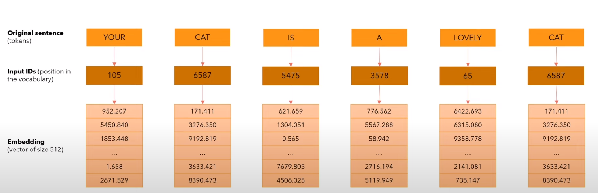
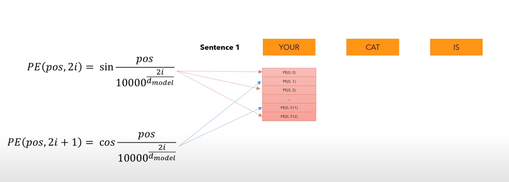
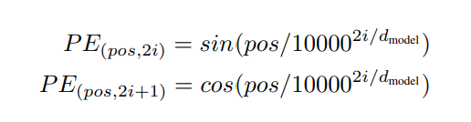
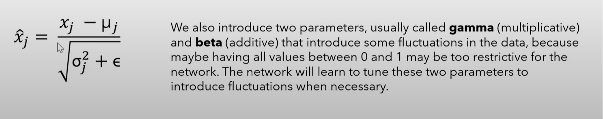

# Why not RNNs?
One main limitation of recurrent neural networks is that it has a limited memory, and can only recall a finite
amount of tokens (sometimes referred to as time steps). Transformer models theoretically have an infinite amount 
of memory/recall.

RNNs are also slow for long sequences.

**TODO** Fill out more.

# Input embedding

This is discussed in section 3.4 in the arXiv paper. Input embeddings is a way to represent our input sentence in 
a vector of `n` dimensions (in the image, 512 dims are used). We do this by first tokenizing our input sentence into
a list of tokens, which are then mapped into their input ID's. Since a single number sometimes doesn't give us 
enough information for a word/vocabulary, we map this to an embedding, which is a vector of size `n`. 
This vector is then learned by the model.

*Note: `n` is usually 512*

We may take the text **hello, how are you?** and translate into the following tokens:
```
<start> <hello> <,> <how> <are> <you> <?> <end>
```
*Note: `<start>` and `<end>` are appeneded and prepended to tell the model when to start and stop IO.*

## Positional encoding

In addition to input embedding, we have an additive encoding to allow the model to know the positions of each word.
Word positioning/context is important, especially in tasks like translation. If we didn't have this, if our input
was **How are you** would have these six options as valid in the embedding:

- How are you
- How you are
- are How you
- are you How
- you How are
- you are How

We solve this by assigning linear positions to the words
```
How        are     you
(p = 0) (p = 1) (p = 2)
```
however just adding these values to the vector would reveal a bias for information towards the end of the sentence 
as `p` grows larger. The paper provides these equations:



# Layer normalization
Layer normalization is exactly how it sounds, given that the values can grow very large given a large vocabulary 
for the dataset, it's easier to normalize the values to a max that we know.

Say we are given the sentence **How are you**, it would be transformed into 3 vectors of dimension 512 after 
input embedding and positional encoding. For each of these vectors, we want to compute the average and standard 
deviation of the 'layer', and change the output based upon this equation:


