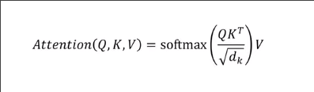
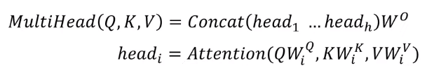
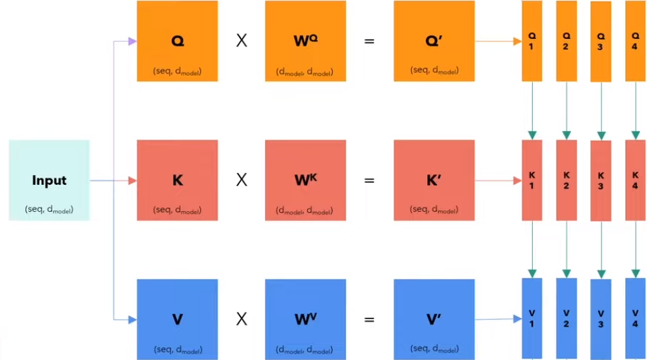
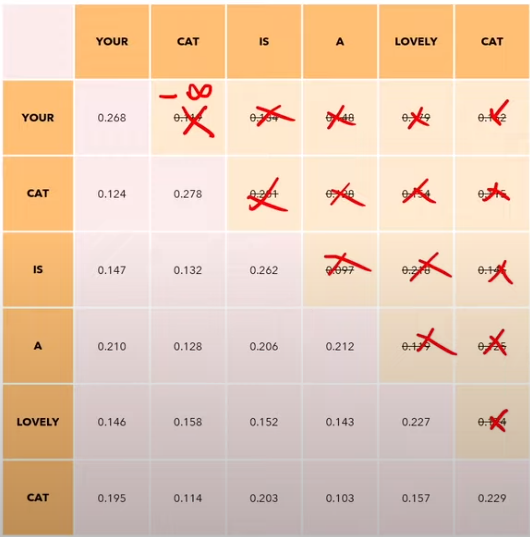
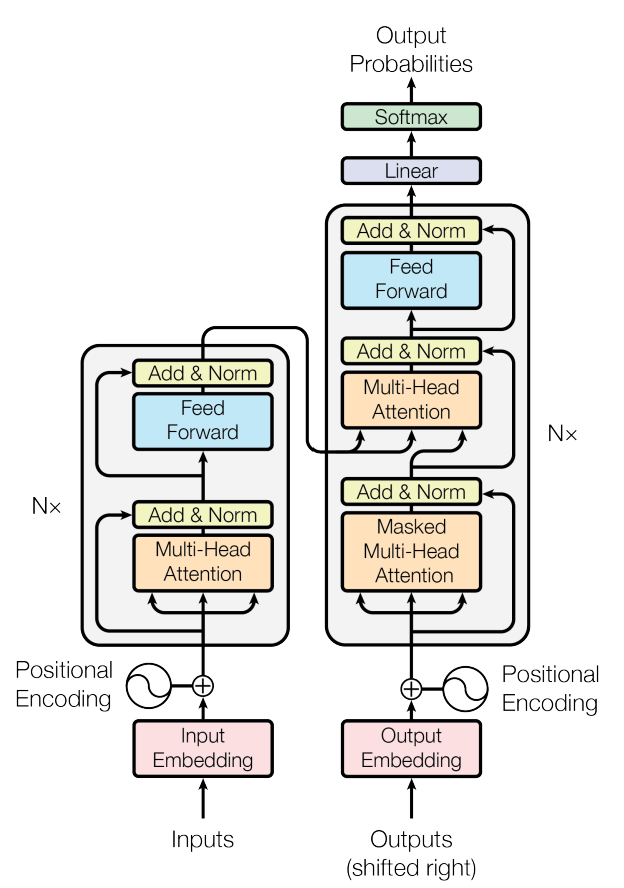

# Why not RNNs?
One main limitation of recurrent neural networks is that it has a limited memory, and can only recall a finite
amount of tokens (sometimes referred to as time steps). Transformer models theoretically have an infinite amount 
of memory/recall.

RNNs are also slow for long sequences.

# Input embedding

This is discussed in section 3.4 in the arXiv paper. Input embeddings is a way to represent our input sentence in 
a vector of `n` dimensions (in the image, 512 dims are used). We do this by first tokenizing our input sentence into
a list of tokens, which are then mapped into their input ID's. Since a single number sometimes doesn't give us 
enough information for a word/vocabulary, we map this to an embedding, which is a vector of size `n`. 
This vector is then learned by the model.

*Note: `n` is usually 512*

We may take the text **hello, how are you?** and translate into the following tokens:
```
<start> <hello> <,> <how> <are> <you> <?> <end>
```
*Note: `<start>` and `<end>` are appeneded and prepended to tell the model when to start and stop IO.*

## Positional encoding

In addition to input embedding, we have an additive encoding to allow the model to know the positions of each word.
Word positioning/context is important, especially in tasks like translation. If we didn't have this, if our input
was **How are you** would have these six options as valid in the embedding:

- How are you
- How you are
- are How you
- are you How
- you How are
- you are How

We solve this by assigning linear positions to the words
```
How        are     you
(p = 0) (p = 1) (p = 2)
```
however just adding these values to the vector would reveal a bias for information towards the end of the sentence 
as `p` grows larger. The paper provides these equations:


# Layer normalization
Layer normalization is exactly how it sounds, given that the values can grow very large given a large vocabulary 
for the dataset, it's easier to normalize the values to a max that we know.

Say we are given the sentence **How are you**, it would be transformed into 3 vectors of dimension 512 after 
input embedding and positional encoding. For each of these vectors, we want to compute the average and standard 
deviation of the 'layer', and change the output based upon this equation:


which results to: $\hat{x}_j*\gamma + \beta$

# Feed Forward
The feed forward mechanism in a transformer model is a crucial component that operates on the output of the attention mechanism. Each layer of the transformer contains a feed forward neural network, which is applied individually to each position separately and identically. This means the same feed forward network is applied to all positions, but independently for each position. 
The purpose of this mechanism is to process and transform the output from the attention layers. It typically consists of two linear transformations with a nonlinear activation function in between, often ReLU (Rectified Linear Unit) or a variant. The feed forward network enables the transformer to integrate and process the information gathered through the self-attention mechanism, contributing to the model's ability to handle complex patterns in data such as language, sound, or images. This architecture allows transformers to be highly parallelizable and efficient in handling sequential data.

# Multi-Head attention
## Self-attention
Multi-Head attention is based upon an existing idea called self-attention, which allows the model to relate words to each other.
The equation for self-attention is as follows:



Where Q, K, and V are all matricies of the input sentence. These matricies come from the input and positional encoding.

These matricies are called this way because the embeddings essentially act as python dictionary keys, values, and searched by with queries.

All this equation is doing is multiplying Q and K (which is a transpose of the input sentence), and dividing by the square root of the dimensions of the model (typically 512). After that we apply *softmax*, which makes each row of the matrix sum up to one. This results in a score for each word of how strongly one word is related to another.

We finally multiply by V (which again, is the input sentence), that gives us a new matrix that we have 6 words with their embedding. This embedding gives us the meaning and position of the output.

We expect the words along the diagonal to be the highest, as each word is most strongly related to itself.

## Multi-head attention


A multi-headed attention block has $N$ heads. For this multi-headed attention, we take in Q, K, and V and multiply by parameter matricies. For each head, we take a slice of each embedding of each word. This allows each head to look at the full sentence, however since we take a slice of the encoding, each head pays attention to a different part of the sentence. We want this because each head can watch different part of the sentence. In English, one word could have multiple different meanings, for example **bat** could refer to an animal, an object, or a verb (to bat something away), each head could look at this word in a different context, which is why having multiple heads is so powerful.



# Encoder
In the encoder, we really just put together all the pieces above. The paper calls for 6 encoding layers, so we just repeat the encoder 6 times

# Decoder
The decoder is just about the same as the encoder, except the decoder takes inputs from the encoder (the K and V matricies mentioned from above), and we are queried by the output embedding. We also have 6 decoding layers.

Additionally, we have a masked multi-head attention, the mask prevents us from 'looking into the future' by a causal mask, by setting the attention scores of all embeddings above the diagonal to zero, to prevent the model cheating.



# Linear Layer
The linear layer tells for every embedding, what word it translates to. It essentially works as a translator for our encoding to actual words.

# Transformer

# Training
> In the paper they had 8 GPUs (P100's, ~96GB vRAM) with 3.5 days of training. My resulting model has ~8 hours of training on 1 20GB vRAM GPU.

In the context of translating from English to Italian, we will first take the English sentence *I love you very much* and add special characters to tell the model when to start and end:
```
<SOS>I love you very much<EOS>
```
We then send this to the input embedding + positional encoding, which is then fed into the encoder.

The encoder will then output for each word a vector that conveys meaning and position, alongside mutli-headed attention, which is it's interaction with other words.

The output shifted right accounts for us starting with the special character `<SOS>`, which also allows us to seach for the next word.
During training, we send this:
```
<SOS>Ti amo molto
```
through embedding and encoding, and send that into the decoder. The decoder has the Q matrix that we use to search in the K and V matricies from the encoder.

We expect and label the output to be
```
Ti amo molto<EOS>
```
calculate the loss (called cross entropy loss), and backpropogate.

## Inference
We only need to compute encoder once, on the input sentence
```
<SOS>I love you very much<EOS>
```
We then initialize the decoder to the `<SOS>` token, which after the first timestep will output `Ti`. 
We then loop through the decoder again, concatenating the output to the input, so we then loop through with `<SOS>Ti`, and keep doing this until we encounter a, `<EOS>` token.

# Dataset / Tokenziation