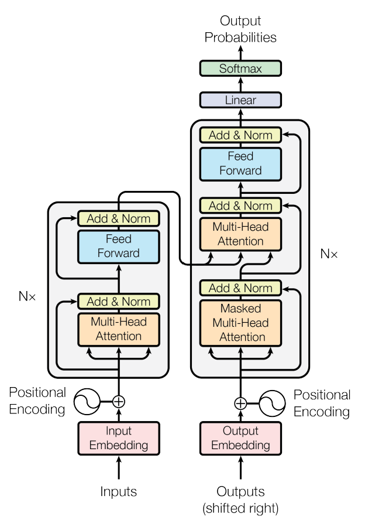

# BETSI
[arXiv paper](https://arxiv.org/abs/1706.03762)

A light implementation of the 2017 Google paper 'Attention is all you need'. BETSI is the name of the model,
which is a [recursive acronym](https://en.wikipedia.org/wiki/Recursive_acronym) standing for
**BETSI: English to shitty Italian**, as the training time I allowed on my graphics card did not give enough
time for amazing results.

For this implementation I will implement a translation from English to Italian, as Tranformer models are exceptional at language 
translation and this seems to be a common use of light implementations of this paper.

The dataset I will be using is the [opus books](https://opus.nlpl.eu/Books.php) dataset which is a collection of copyright free books.
The book content of these translations are free for personal, educational, and research use. 
[OPUS language resource paper](http://www.lrec-conf.org/proceedings/lrec2012/pdf/463_Paper.pdf).

## Notes
I'm creating notes as I go, which can be found in [NOTES.md](./NOTES.md).

## Transformer model architecture

## Requirements
There is a [requirements.txt](./requirements.txt) that has the packages needed to run this.
I used PyTorch with [ROCm](https://en.wikipedia.org/wiki/ROCm) as this sped up training A LOT. Training this model on CPU on 
my laptop takes around 5.5 hours per epoch, while training the model on GPU on my desktop takes around 13.5 minutes (24.4 times faster!).

## TODO and tenative timeline:
- [X] Input Embeddings
- [X] Positional Encoding
- [X] Layer Normalization **- Due by 11/1**
- [X] Feed forward
- [X] Multi-Head attention
- [X] Residual Connection
- [X] Encoder
- [X] Decoder **- Due by 11/8**
- [X] Linear Layer
- [X] Transformer
- [X] Tokenizer **- Due by 11/15**
- [X] Dataset
- [X] Training loop
- [X] Visualization of the model **- Due by 11/22**
- [X] Install AMD RocM to train with GPU **- Attempt to do by end**

## References used
- [Dropout information](https://machinelearningmastery.com/dropout-for-regularizing-deep-neural-networks/)
- [Input embedding and positional encoding video](https://www.youtube.com/watch?v=3mTsYm9qQFA)
- [arXiv paper](https://arxiv.org/abs/1706.03762)
- [Transformer model overview](https://www.youtube.com/watch?v=4Bdc55j80l8)
